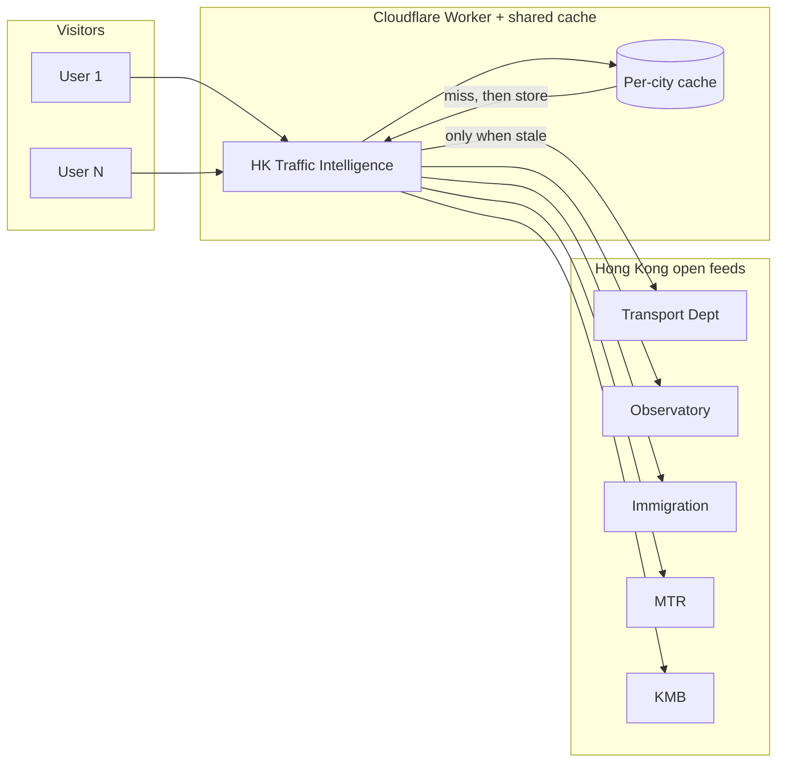

[繁體中文](README.zh-HK.md)

<div align="center">

# HK Traffic Intelligence

**One map. The live open feeds this board wires together.**

Not everything on [DATA.GOV.HK](https://data.gov.hk) — just the public traffic, transit, border, and weather APIs that belong on one ops-style board: harbour minutes, strategic-road speed, cameras, works, toll points, incidents, land control points, Observatory warnings, MTR next train, and KMB ETA.

[](https://hktraffic.keith-li.workers.dev)
[](https://nextjs.org/)
[](https://maplibre.org/)
[](https://workers.cloudflare.com/)

No account. No install. Opens in **Traditional Chinese** (Hong Kong written form); **English** sits beside the clock.

</div>


---

## The city already talks. This board listens.

Hong Kong does not hide its traffic story. Transport Department paints strategic roads. HKeMobility posts harbour minutes and camera stills. Immigration publishes border hall times. The Observatory raises warnings. MTR and KMB publish the next train and the next bus.

The data is **public**. The problem is **fragmentation** — even this *subset* of feeds lives on different portals and refreshes on different clocks. You cannot read them in one glance.

**HK Traffic Intelligence** fuses **these wired-in feeds** into a single MapLibre canvas: read the crossing you care about, spot the road that just turned red, glance at Lo Wu, check whether the Black Rain signal is up — without opening six tabs.

> This is not a turn-by-turn navigator. It is a **city pulse** for commuters, journalists, students, and anyone who wants to see how open data becomes something you can actually use.

---

## What you get in sixty seconds

| | |
| --- | --- |
| **Harbour crossings** | Cross-Harbour, Eastern Harbour, Western Harbour — **minutes from real approach roads**. Green · amber · red. Tap a reading; the map flies to that approach. |
| **Road speed** | Official TD saturation (**Good · Average · Bad**) on strategic centrelines, with moving dots that match live speed. |
| **Cameras** | Public TD snapshots — tunnel mouths stay visible when zoomed out; the rest appear as you move in. |
| **Works · tunnels · incidents** | Fast-road works, toll points, open special traffic news. |
| **Border control** | Eight land points — passenger halls; vehicle line shows live speed on the road that feeds each port. |
| **Weather** | Every HKO warning in force; quiet skies still show Observatory temp and rain in the last hour. |
| **MTR** | Published next-train minutes (position is **estimated** along track — MTR does not ship GPS). |
| **KMB** | Published ETAs at nearby stops when you zoom in (no published route geometry — stops only). |
| **Intel strip** | Ranked “read this first”: incidents, bad roads, busy halls, warnings — dock or ticker, with show/hide animation. |
| **Basemaps** | Satellite · [OSM Bright](https://github.com/openmaptiles/osm-bright-gl-style) streets · [OSM Liberty](https://github.com/maputnik/osm-liberty) **3D buildings** (labels and markers tuck under the roofs). |

---

## Built so popularity does not punish the sources

**Principle: never hammer other people’s servers.**

The live site keeps **one shared copy** of each upstream feed on Cloudflare’s edge. While that copy is fresh, the next ten thousand visitors read the cache — not Transport Department again.

| Feed family | Typical refresh |
| --- | --- |
| MTR next train | ~15 s |
| KMB ETA | ~30 s |
| TD · ImmD · HKO · cameras · works | ~60 s |

Same rhythm as the board’s polling. One city, one cache namespace (`hktraffic-feeds`), **`Cache-Control: public`** — designed for **10k+ concurrent readers** without becoming a denial-of-service against government APIs.

<details>
<summary><strong>How the cache fits together (click to expand)</strong></summary>



</details>

---

## Try it locally

**Node.js 22**

```bash
git clone https://github.com/keithligh/hk-traffic-intelligence.git
cd hk-traffic-intelligence
npm install
npm run dev
```

Open **[http://127.0.0.1:4317](http://127.0.0.1:4317)**.

### Dock controls (bottom bar)

| Control | Layer |
| --- | --- |
| **Satellite** | Esri imagery — flat so coloured roads sit on the pavement |
| **Streets** | OSM Bright via [OpenFreeMap](https://openfreemap.org) |
| **Buildings** | OSM Liberty 3D — press again to return to your previous basemap |
| **Speed · Cameras · Works · Tunnels · Incidents · Boundary · MTR · KMB** | Toggle data overlays |

### Dev commands

| Command | Purpose |
| --- | --- |
| `npm run dev` | Next.js dev server (4317) |
| `npm run lint` | ESLint |
| `npm run dev:vinext` | Cloudflare-oriented dev (4318) |
| `npm run deploy:vinext` | Deploy Worker (needs Cloudflare credentials) |

**Failure modes for QA:** `?feed=down` (speed feed dead) · `?map=down` (header stays, map absent).

**Stack:** Next.js · React · MapLibre GL · Tailwind CSS · TypeScript · `@vinext/cloudflare` on Workers.

---

## Where this board’s numbers come from

Road geometry: TD **strategic centreline** (Hong Kong 1980 grid), shifted by Lands Department territory correction (**+8.8″ lon, −5.5″ lat**) so lines land on the pavement.

| On the board | Open data |
| --- | --- |
| Strategic road speed & official colour | [Traffic data — strategic & major roads](https://data.gov.hk/en-data/dataset/hk-td-sm_4-traffic-data-strategic-major-roads) · [HKeMobility](https://www.hkemobility.gov.hk/en/) |
| Road shapes | [Road Network v2](https://data.gov.hk/en-data/dataset/hk-td-tis_15-road-network-v2) |
| Harbour minutes | Journey-time boards · [HKeMobility](https://www.hkemobility.gov.hk/en/) |
| Cameras (EN + 繁) | Snapshot layers · [HKeMobility](https://www.hkemobility.gov.hk/en/) |
| Road works · toll points | [HKeMobility](https://www.hkemobility.gov.hk/en/) |
| Special traffic news | [Dataset](https://data.gov.hk/en-data/dataset/hk-td-tis_19-special-traffic-news-v2) |
| Smart lamppost detectors | [Dataset](https://data.gov.hk/en-data/dataset/hk-td-tis_33-traffic-data-traffic-detectors-installed-at-smart-lampposts) |
| Border waiting times | [ImmD land BCP](https://data.gov.hk/en-data/dataset/hk-immd-set28-land-boundary-control-points-waiting-time) |
| MTR next train | [Dataset](https://data.gov.hk/en-data/dataset/mtr-data2-nexttrain-data) · station footprints [CSDI](https://portal.csdi.gov.hk/csdi-webpage/apidoc/3d-indoor-mtr-station-map) |
| KMB ETA | [eTA Bus API](https://data.etabus.gov.hk/v1/transport/kmb/stop) |
| Warnings · weather | [HKO warnsum](https://data.weather.gov.hk/weatherAPI/opendata/weather.php?dataType=warnsum&lang=en) · [rhrread](https://data.weather.gov.hk/weatherAPI/opendata/weather.php?dataType=rhrread&lang=en) |
| Vector basemaps | [OSM Bright](https://github.com/openmaptiles/osm-bright-gl-style) · [OSM Liberty](https://github.com/maputnik/osm-liberty) · [OpenFreeMap](https://openfreemap.org) · © OpenStreetMap |
| Satellite | [Esri World Imagery](https://server.arcgisonline.com/ArcGIS/rest/services/World_Imagery/MapServer) |

---

## Why this repo exists

Government open data is only half the story. The other half is **craft**: geodesy that matches Hong Kong’s grid, colours that respect TD’s legend, Chinese copy that reads like a notice, edge caching that scales without guilt, and a map that still works when one feed drops.

**[Keith Li](https://www.linkedin.com/in/keithlihk)** built this board for **Agentic Engineer** classes, public talks, and guest lectures — to show how agents (and engineers) can turn scattered APIs into something a human loves to open.

**Created by:** [Keith Li](https://www.linkedin.com/in/keithlihk) · [GitHub](https://github.com/keithligh)

If this saves you a crossing or teaches one student what “open” really means, **star the repo** and share the live link.
