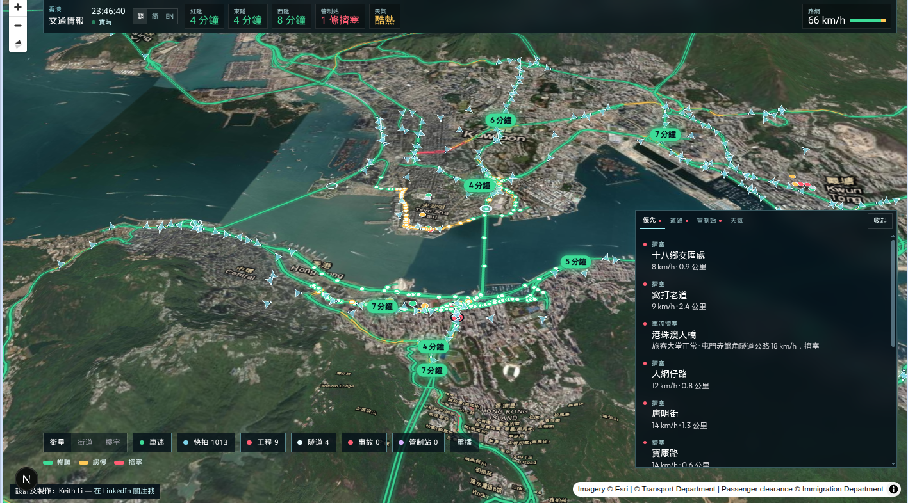
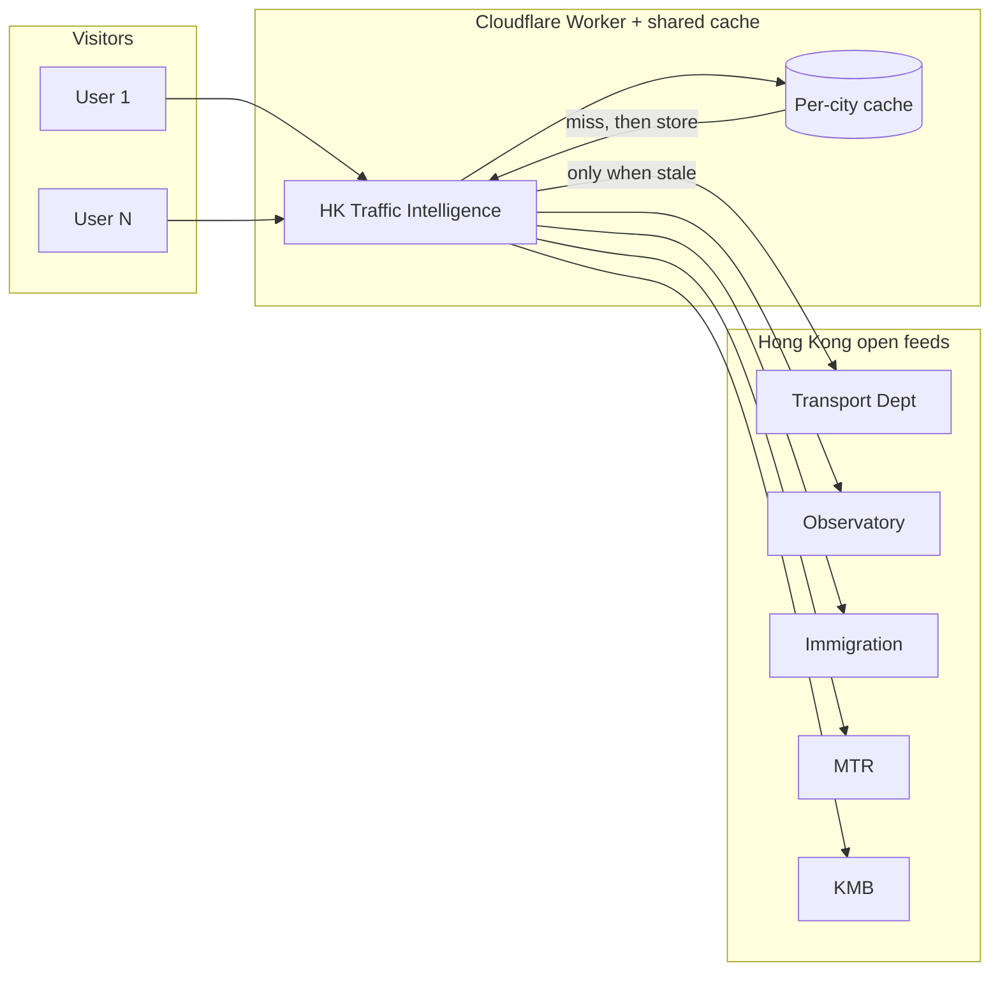

[繁體中文](README.zh-HK.md)

<div align="center">

# HK Traffic Intelligence

A live map of Hong Kong traffic. The numbers on screen come from open data published by Transport Department, HKeMobility, Immigration, the Observatory, MTR, and KMB.

[](https://hktraffic.keith-li.workers.dev)
[](LICENSE)

The board is at [hktraffic.keith-li.workers.dev](https://hktraffic.keith-li.workers.dev).

[](https://nextjs.org/)
[](https://maplibre.org/)
[](https://workers.cloudflare.com/)

Open source ([MIT](LICENSE)). Use the live site, or clone it and run it yourself. Forks are welcome; please keep credit to this project.

No account needed. Opens in **Traditional Chinese** (Hong Kong written form). **English** sits beside the clock.

</div>



---

## What this is

Hong Kong already publishes the numbers: Transport Department on strategic roads, HKeMobility on harbour minutes and cameras, Immigration on land control points, the Observatory on warnings, MTR and KMB on the next train and bus.

The feeds are **public**. They are also **scattered** across portals and refresh on different clocks. This project does not cover every dataset on [DATA.GOV.HK](https://data.gov.hk). It draws the feeds used on this board onto one MapLibre map so you can read a crossing, a red road, Lo Wu, or an active warning without opening six tabs.

It is **not** a turn-by-turn navigator. It is a traffic board for reading the city, and for showing how open data becomes one picture.

---

## Features

| | |
| --- | --- |
| **Harbour crossings** | Cross-Harbour, Eastern Harbour, Western Harbour. **Minutes from real approach roads.** Green, amber, red. Tap a reading and the map moves to that approach. |
| **Road speed** | Official TD saturation (Good, Average, Bad) on strategic centrelines, with moving dots that match live speed. |
| **Cameras** | Public TD snapshots. Tunnel mouths stay visible when zoomed out; the rest appear as you move in. |
| **Works, tunnels, incidents** | Fast-road works, toll points, open special traffic news. |
| **Border control** | Eight land points and passenger halls. The vehicle line shows live speed on the strategic road that feeds each port. |
| **Weather** | All HKO warnings in force; quiet skies still show Observatory temperature and rain in the last hour. |
| **MTR** | Published next-train minutes. Train position is **estimated** along the track because MTR does not publish GPS. |
| **KMB** | Published ETAs at nearby stops when you zoom in. No published route geometry, so the map shows stops only. |
| **Intel** | Ranked items to read first: incidents, bad roads, busy halls, warnings. Dock or ticker, with show and hide animation. |
| **Basemaps** | Satellite, [OSM Bright](https://github.com/openmaptiles/osm-bright-gl-style) streets, [OSM Liberty](https://github.com/maputnik/osm-liberty) 3D buildings. Labels and markers sit under the roofs in the buildings view. |

---

## Shared feeds (do not hammer upstream)

**Principle: never hammer other people's servers.**

The live site keeps **one shared copy** of each upstream feed on Cloudflare's edge. While that copy is fresh, the next ten thousand visitors read the cache, not Transport Department again.

| Feed family | Typical refresh |
| --- | --- |
| MTR next train | ~15 s |
| KMB ETA | ~30 s |
| TD, ImmD, HKO, cameras, works | ~60 s |

Same rhythm as the board's polling. One city, one cache namespace (`hktraffic-feeds`), `Cache-Control: public`. Many people can read the site at once without overloading government servers.

<details>
<summary><strong>How the cache fits together (click to expand)</strong></summary>



</details>

---

## Run it yourself

This project is **open source**. You can clone it, run it locally, and fork it. Please keep the copyright notice and credit [HK Traffic Intelligence](https://github.com/keithligh/hk-traffic-intelligence) / [Keith Li](https://github.com/keithligh).

**Node.js 22**

```bash
git clone https://github.com/keithligh/hk-traffic-intelligence.git
cd hk-traffic-intelligence
npm install
npm run dev
```

Open [http://127.0.0.1:4317](http://127.0.0.1:4317).

### Dock controls (bottom bar)

| Control | Layer |
| --- | --- |
| **Satellite** | Esri imagery, kept flat so coloured roads sit on the pavement |
| **Streets** | OSM Bright via [OpenFreeMap](https://openfreemap.org) |
| **Buildings** | OSM Liberty 3D. Press again to return to your previous basemap |
| **Speed, Cameras, Works, Tunnels, Incidents, Boundary, MTR, KMB** | Toggle data overlays |

### Dev commands

| Command | Purpose |
| --- | --- |
| `npm run dev` | Next.js dev server (4317) |
| `npm run lint` | ESLint |
| `npm run dev:vinext` | Cloudflare-oriented dev (4318) |
| `npm run deploy:vinext` | Deploy Worker (needs Cloudflare credentials) |

**Failure modes for QA:** `?feed=down` (speed feed dead), `?map=down` (header stays, map absent).

**Stack:** Next.js, React, MapLibre GL, Tailwind CSS, TypeScript, `@vinext/cloudflare` on Workers.

---

## Where this board's numbers come from

Road geometry uses the TD **strategic centreline** (Hong Kong 1980 grid), shifted by the Lands Department territory correction (+8.8″ longitude, −5.5″ latitude) so lines land on the pavement.

| On the board | Open data |
| --- | --- |
| Strategic road speed and official colour | [Traffic data, strategic and major roads](https://data.gov.hk/en-data/dataset/hk-td-sm_4-traffic-data-strategic-major-roads), [HKeMobility](https://www.hkemobility.gov.hk/en/) |
| Road shapes | [Road Network v2](https://data.gov.hk/en-data/dataset/hk-td-tis_15-road-network-v2) |
| Harbour minutes | Journey-time boards, [HKeMobility](https://www.hkemobility.gov.hk/en/) |
| Cameras (EN and 繁) | Snapshot layers, [HKeMobility](https://www.hkemobility.gov.hk/en/) |
| Road works and toll points | [HKeMobility](https://www.hkemobility.gov.hk/en/) |
| Special traffic news | [Dataset](https://data.gov.hk/en-data/dataset/hk-td-tis_19-special-traffic-news-v2) |
| Smart lamppost detectors | [Dataset](https://data.gov.hk/en-data/dataset/hk-td-tis_33-traffic-data-traffic-detectors-installed-at-smart-lampposts) |
| Border waiting times | [ImmD land BCP](https://data.gov.hk/en-data/dataset/hk-immd-set28-land-boundary-control-points-waiting-time) |
| MTR next train | [Dataset](https://data.gov.hk/en-data/dataset/mtr-data2-nexttrain-data), station footprints [CSDI](https://portal.csdi.gov.hk/csdi-webpage/apidoc/3d-indoor-mtr-station-map) |
| KMB ETA | [eTA Bus API](https://data.etabus.gov.hk/v1/transport/kmb/stop) |
| Warnings and weather | [HKO warnsum](https://data.weather.gov.hk/weatherAPI/opendata/weather.php?dataType=warnsum&lang=en), [rhrread](https://data.weather.gov.hk/weatherAPI/opendata/weather.php?dataType=rhrread&lang=en) |
| Vector basemaps | [OSM Bright](https://github.com/openmaptiles/osm-bright-gl-style), [OSM Liberty](https://github.com/maputnik/osm-liberty), [OpenFreeMap](https://openfreemap.org), © OpenStreetMap |
| Satellite | [Esri World Imagery](https://server.arcgisonline.com/ArcGIS/rest/services/World_Imagery/MapServer) |

---

## Author and licence

[Keith Li](https://www.linkedin.com/in/keithlihk) built this for **Agentic Engineer** classes, public talks, and guest lectures. The data was already public. The work is to make those feeds one city a person can read.

Released under the [MIT License](LICENSE). Forks and reuse are welcome. Please keep the copyright notice and credit this project.

**Created by:** [Keith Li](https://www.linkedin.com/in/keithlihk), [GitHub](https://github.com/keithligh)
