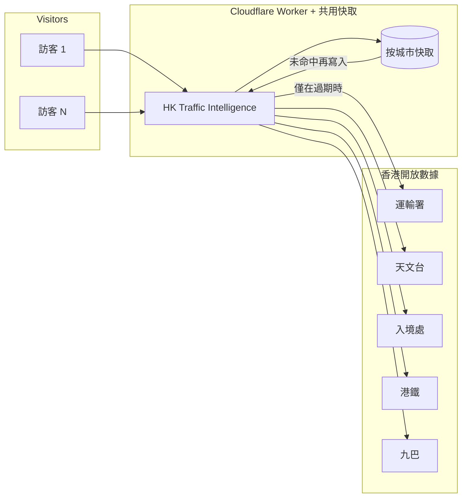

[English](README.md)

<div align="center">

# HK Traffic Intelligence

**一幅地圖，接駁這塊板實際使用的開放數據。**

不是 [DATA.GOV.HK](https://data.gov.hk) 上的全部數據集，而是已接入同一塊交通儀表板的公開來源：過海分鐘、策略性道路車速、快拍、道路工程、收費點、特別交通消息、陸路管制站、天文台警告、港鐵下一班、九巴到站。

[](https://hktraffic.keith-li.workers.dev)
[](https://nextjs.org/)
[](https://maplibre.org/)
[](https://workers.cloudflare.com/)

儀表板毋須帳戶，亦毋須安裝。畫面以繁體中文開啟，用的是香港通告的書面中文；英文在時鐘旁。

</div>


---

## 這是什麼

運輸署為策略性道路提供車速與飽和等級；HKeMobility 公布過海分鐘與快拍；入境事務處公布陸路管制站輪候；天文台公布生效警告；港鐵與九巴公布下一班車。數字本來就是公開的。

難處在分散：即使只是這個子集，也分別在不同網站更新。本項目把已接駁的來源畫在同一幅 MapLibre 地圖上，方便讀過海時間、擠塞路段、羅湖大堂或生效中的警告，而毋須同時開六個分頁。

**不提供行車路線。** 這塊板用來讀一座城市，也用來說明公開數據怎樣變成同一幅畫面。

---

## 功能

| | |
| --- | --- |
| **過海隧道** | 紅磡海底隧道、東區海底隧道、西區海底隧道。分鐘來自真實進路。綠、黃、紅。點一下讀數，地圖移到該進路。 |
| **車速** | 運輸署飽和等級（暢順、緩慢、擠塞）畫在策略性中心線上；有實時車速的路段上有流動圓點。 |
| **快拍** | 運輸署公共快拍，包括隧道口。海港與隧道口在縮小畫面時仍會顯示；其餘須放大才出現。 |
| **工程、隧道、意外** | 限速 70 km/h 或以上道路的工程、過海隧道與大欖隧道收費點、未結束的特別交通消息。 |
| **陸路管制站** | 八個口岸的旅客大堂。大堂旁車輛讀數為通往該口岸的策略性道路實時車速。 |
| **天氣** | 生效中的天文台警告；天色平靜時仍顯示天文台氣溫，以及過去一小時有否下雨。 |
| **港鐵** | 公布的下一班分鐘、終點與月台。港鐵沒有公布列車位置；圓點按分鐘沿路軌推算，卡片寫明落在哪兩個站之間。 |
| **九巴** | 九巴公布的到站時間。放大後顯示畫面中間附近的車站；九巴沒有公布行車路線，地圖只顯示車站。 |
| **情報** | 優先閱讀清單：意外、擠塞道路、繁忙大堂、警告。可收起，收起後沿底部顯示；收起與展開均有動畫。 |
| **底圖** | 衛星照片、[OSM Bright](https://github.com/openmaptiles/osm-bright-gl-style) 街道圖、[OSM Liberty](https://github.com/maputnik/osm-liberty) 立體樓宇。樓宇畫面中，標籤與標記在屋頂之下。 |

---

## 共用的數據

**原則：絕不向他人的伺服器重複索取。**

公開網站為每一項上游數據保留一份共用副本，訪客讀的是這份副本。副本仍然有效時，新的訪客不會再向運輸署等部門伺服器發出新請求。

| 數據類別 | 大約更新間隔 |
| --- | --- |
| 港鐵下一班 | ~15 秒 |
| 九巴到站 | ~30 秒 |
| 運輸署、入境處、天文台、快拍、工程 | ~60 秒 |

有效時間與儀表板的更新節奏一致。按 Cloudflare 城市存放（`hktraffic-feeds`），`Cache-Control: public`，供大量同時在線讀者使用，而不對政府 API 造成拒絕服務。

<details>
<summary><strong>快取如何配合（按此開啟）</strong></summary>



</details>

---

## 快速開始

需要 Node.js 22。

```bash
git clone https://github.com/keithligh/hk-traffic-intelligence.git
cd hk-traffic-intelligence
npm install
npm run dev
```

開啟 [http://127.0.0.1:4317](http://127.0.0.1:4317)。

### 底部控制列

| 控制 | 圖層 |
| --- | --- |
| **衛星** | Esri 照片。畫面保持平坦，著色道路才落在街上。 |
| **街道** | [OSM Bright](https://github.com/openmaptiles/osm-bright-gl-style)，由 [OpenFreeMap](https://openfreemap.org) 提供。 |
| **樓宇** | [OSM Liberty](https://github.com/maputnik/osm-liberty) 立體樓宇。再按一次返回先前的底圖。 |
| **車速、快拍、工程、隧道、意外、管制站、港鐵、九巴** | 開關數據圖層。 |

### 開發

| 指令 | 作用 |
| --- | --- |
| `npm run dev` | 在 4317 埠啟動 Next.js |
| `npm run lint` | ESLint |
| `npm run dev:vinext` | 在 4318 埠啟動供 Cloudflare 使用的開發伺服器 |
| `npm run deploy:vinext` | 在已有 Cloudflare 憑證時部署 Worker |

加上 `?feed=down` 可查看車速數據失敗時的畫面；加上 `?map=down`，地圖不在時頂列仍在。

程式以 Next.js、React、MapLibre GL、Tailwind CSS 及 TypeScript 撰寫，以 Cloudflare Worker 提供服務。

---

## 畫面上的數字從哪裏來

道路形狀為運輸署策略性中心線（香港 1980 坐標）。地政總署公布的全港改正為經度加 8.8 角秒、緯度減 5.5 角秒；改完後，線才落在路上。

| 畫面上 | 開放數據 |
| --- | --- |
| 策略性道路車速與官方顏色 | [策略性道路及主要道路交通數據](https://data.gov.hk/tc-data/dataset/hk-td-sm_4-traffic-data-strategic-major-roads)、[HKeMobility](https://www.hkemobility.gov.hk/tc/) |
| 道路形狀 | [道路網絡（第二代）](https://data.gov.hk/tc-data/dataset/hk-td-tis_15-road-network-v2) |
| 過海分鐘 | [HKeMobility](https://www.hkemobility.gov.hk/tc/) 行車時間 |
| 快拍（英、繁） | [HKeMobility](https://www.hkemobility.gov.hk/tc/) 快拍圖層 |
| 道路工程、收費點 | [HKeMobility](https://www.hkemobility.gov.hk/tc/) |
| 特別交通消息 | [特別交通消息](https://data.gov.hk/tc-data/dataset/hk-td-tis_19-special-traffic-news-v2) |
| 智慧燈柱探測器 | [智慧燈柱交通探測器](https://data.gov.hk/tc-data/dataset/hk-td-tis_33-traffic-data-traffic-detectors-installed-at-smart-lampposts) |
| 口岸輪候 | 入境事務處 [陸路管制站輪候時間](https://data.gov.hk/tc-data/dataset/hk-immd-set28-land-boundary-control-points-waiting-time) |
| 港鐵下一班 | [下一班車](https://data.gov.hk/tc-data/dataset/mtr-data2-nexttrain-data)；車站位置為地政總署 [車站室內平面](https://portal.csdi.gov.hk/csdi-webpage/apidoc/3d-indoor-mtr-station-map) |
| 九巴到站 | [九巴及龍運預計到站時間](https://data.etabus.gov.hk/v1/transport/kmb/stop) |
| 警告、氣溫、雨量 | 天文台 [警告摘要](https://data.weather.gov.hk/weatherAPI/opendata/weather.php?dataType=warnsum&lang=tc)、[本港地區天氣報告](https://data.weather.gov.hk/weatherAPI/opendata/weather.php?dataType=rhrread&lang=tc) |
| 街道圖與樓宇 | [OSM Bright](https://github.com/openmaptiles/osm-bright-gl-style)、[OSM Liberty](https://github.com/maputnik/osm-liberty)，由 [OpenFreeMap](https://openfreemap.org) 提供；© [OpenStreetMap](https://www.openstreetmap.org/copyright) |
| 衛星照片 | [Esri World Imagery](https://server.arcgisonline.com/ArcGIS/rest/services/World_Imagery/MapServer)。影像 © Esri |

---

## 作者

[Keith Li](https://www.linkedin.com/in/keithlihk)。這塊板用於 Agentic Engineer 課堂、公開演講及大學客席講座。數據本來就是公開的；要做的是讓這些數據成為一座人讀得懂的城市。

**製作：** [Keith Li](https://www.linkedin.com/in/keithlihk) / [GitHub](https://github.com/keithligh)
