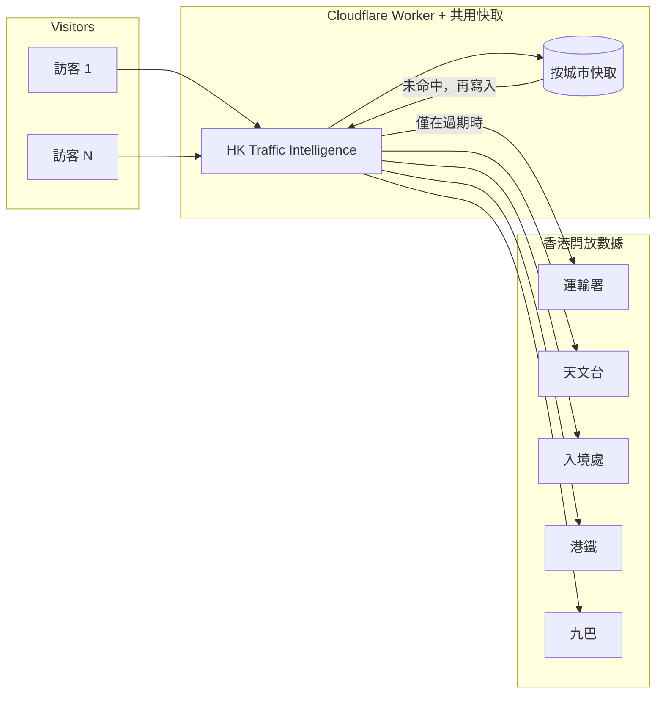

[English](README.md)

<div align="center">

# HK Traffic Intelligence

**一幅地圖，接駁這塊板實際使用的開放數據。**

不是 [DATA.GOV.HK](https://data.gov.hk) 上的全部數據集——而是適合放在同一塊交通儀表板上的公開來源：過海分鐘、策略性道路車速、快拍、道路工程、收費點、特別交通消息、陸路管制站、天文台警告、港鐵下一班、九巴到站。

[](https://hktraffic.keith-li.workers.dev)
[](https://nextjs.org/)
[](https://maplibre.org/)
[](https://workers.cloudflare.com/)

毋須帳戶，毋須安裝。預設以**繁體中文**（香港書面語）開啟；**英文**在時鐘旁。

</div>


---

## 城市一直在說話，這塊板在聽

香港並沒有把交通故事藏起來。運輸署為策略性道路著色；HKeMobility 公布過海分鐘與快拍；入境處發布口岸大堂輪候；天文台升起警告；港鐵與九巴公布下一班車。

數據是**公開**的。難處在**分散**——即使只是這個**子集**，也分散在不同入口、以不同節奏更新。你無法在一個畫面一次讀完。

**HK Traffic Intelligence** 把**已接駁的這些來源**合成一幅 MapLibre 地圖：關心哪條過海隧道就讀哪條、哪段路剛轉紅一眼看見、羅湖是否繁忙、黑色暴雨警告是否生效——毋須同時開六個分頁。

> 這不是 turn-by-turn 導航。這是給通勤者、記者、學生，以及任何想見證「開放數據如何變成用得着的東西」的人，一個**城市脈搏**。

---

## 六十秒能看見什麼

| | |
| --- | --- |
| **過海隧道** | 紅磡海底隧道、東區海底隧道、西區海底隧道——**分鐘來自真實進路**。綠 · 黃 · 紅。點一下讀數，地圖飛到該進路。 |
| **車速** | 運輸署官方飽和等級（**暢順 · 緩慢 · 擠塞**）畫在策略性中心線上，圓點隨實時車速流動。 |
| **快拍** | 運輸署公共快拍——隧道口在縮小時仍保留；其餘隨你拉近出現。 |
| **工程 · 隧道 · 意外** | 快速公路工程、收費點、未結束的特別交通消息。 |
| **陸路管制站** | 八個口岸旅客大堂；車輛欄顯示通往該口岸策略性道路的實時車速。 |
| **天氣** | 生效中的天文台警告全部列出；天色平靜時仍顯示天文台氣溫與過去一小時有否下雨。 |
| **港鐵** | 公布的下一班分鐘（列車位置沿軌道**推算**——港鐵不提供 GPS）。 |
| **九巴** | 拉近後附近車站的公布到站時間（無公布行車路線——只顯示車站）。 |
| **情報列** | 「先讀這些」：意外、擠塞路段、繁忙大堂、警告——可收起或沿底部滾動，附動畫。 |
| **底圖** | 衛星 · [OSM Bright](https://github.com/openmaptiles/osm-bright-gl-style) 街道 · [OSM Liberty](https://github.com/maputnik/osm-liberty) **立體樓宇**（標籤與標記在屋頂之下）。 |

---

## 人多了，也不會拖垮別人的伺服器

**原則：絕不狂轟他人的伺服器。**

公開網站在 Cloudflare 邊緣為每一項上游數據保留**一份共用副本**。副本仍有效時，下一萬名訪客讀的是快取——不是再向運輸署要一次。

| 數據類別 | 大約更新間隔 |
| --- | --- |
| 港鐵下一班 | ~15 秒 |
| 九巴到站 | ~30 秒 |
| 運輸署 · 入境 · 天文台 · 快拍 · 工程 | ~60 秒 |

與儀表板輪詢節奏一致。每座城市一份快取（`hktraffic-feeds`），**`Cache-Control: public`**——為 **一萬以上**同時在線讀者而設，卻不會對政府 API 構成拒絕服務。

<details>
<summary><strong>快取如何串連（按此展開）</strong></summary>



</details>

---

## 在本機試玩

**Node.js 22**

```bash
git clone https://github.com/keithligh/hk-traffic-intelligence.git
cd hk-traffic-intelligence
npm install
npm run dev
```

開啟 **[http://127.0.0.1:4317](http://127.0.0.1:4317)**。

### 底部控制列

| 控制 | 圖層 |
| --- | --- |
| **衛星** | Esri 影像——保持平坦，著色道路才落在路面上 |
| **街道** | OSM Bright，由 [OpenFreeMap](https://openfreemap.org) 提供 |
| **樓宇** | OSM Liberty 立體——再按一次回到先前的底圖 |
| **車速 · 快拍 · 工程 · 隧道 · 意外 · 管制站 · 港鐵 · 九巴** | 開關數據圖層 |

### 開發指令

| 指令 | 作用 |
| --- | --- |
| `npm run dev` | Next.js 開發伺服器（4317） |
| `npm run lint` | ESLint |
| `npm run dev:vinext` | 面向 Cloudflare 的開發（4318） |
| `npm run deploy:vinext` | 部署 Worker（需 Cloudflare 憑證） |

**測試故障畫面：** `?feed=down`（車速數據失敗）· `?map=down`（保留頂列、地圖缺席）。

**技術棧：** Next.js · React · MapLibre GL · Tailwind CSS · TypeScript · `@vinext/cloudflare` on Workers。

---

## 畫面上的數字從哪裏來

道路幾何：運輸署**策略性中心線**（香港 1980 坐標），再用地政總署全港改正（**經度 +8.8 角秒、緯度 −5.5 角秒**），線才落在路上。

| 畫面上 | 開放數據 |
| --- | --- |
| 策略性道路車速與官方顏色 | [策略性道路及主要道路交通數據](https://data.gov.hk/tc-data/dataset/hk-td-sm_4-traffic-data-strategic-major-roads) · [HKeMobility](https://www.hkemobility.gov.hk/tc/) |
| 道路形狀 | [道路網絡（第二代）](https://data.gov.hk/tc-data/dataset/hk-td-tis_15-road-network-v2) |
| 過海分鐘 | 行車時間 · [HKeMobility](https://www.hkemobility.gov.hk/tc/) |
| 快拍（英 · 繁） | 快拍圖層 · [HKeMobility](https://www.hkemobility.gov.hk/tc/) |
| 道路工程 · 收費點 | [HKeMobility](https://www.hkemobility.gov.hk/tc/) |
| 特別交通消息 | [數據集](https://data.gov.hk/tc-data/dataset/hk-td-tis_19-special-traffic-news-v2) |
| 智慧燈柱探測器 | [數據集](https://data.gov.hk/tc-data/dataset/hk-td-tis_33-traffic-data-traffic-detectors-installed-at-smart-lampposts) |
| 口岸輪候 | [入境處陸路管制站](https://data.gov.hk/tc-data/dataset/hk-immd-set28-land-boundary-control-points-waiting-time) |
| 港鐵下一班 | [數據集](https://data.gov.hk/tc-data/dataset/mtr-data2-nexttrain-data) · 車站平面 [CSDI](https://portal.csdi.gov.hk/csdi-webpage/apidoc/3d-indoor-mtr-station-map) |
| 九巴到站 | [eTA Bus API](https://data.etabus.gov.hk/v1/transport/kmb/stop) |
| 警告 · 天氣 | [天文台 warnsum](https://data.weather.gov.hk/weatherAPI/opendata/weather.php?dataType=warnsum&lang=tc) · [rhrread](https://data.weather.gov.hk/weatherAPI/opendata/weather.php?dataType=rhrread&lang=tc) |
| 矢量底圖 | [OSM Bright](https://github.com/openmaptiles/osm-bright-gl-style) · [OSM Liberty](https://github.com/maputnik/osm-liberty) · [OpenFreeMap](https://openfreemap.org) · © OpenStreetMap |
| 衛星 | [Esri World Imagery](https://server.arcgisonline.com/ArcGIS/rest/services/World_Imagery/MapServer) |

---

## 為何有這個 repo

政府開放數據只講了一半。另一半是**工藝**：配合香港坐標的測地、尊重運輸署圖例的顏色、讀起來像通告的中文、可以擴展而心裏過意得去的邊緣快取，以及某一條 feed 斷線時地圖仍然站得住。

**[Keith Li](https://www.linkedin.com/in/keithlihk)** 造這塊板，給 **Agentic Engineer** 課堂、公開演講與客席講座——示範 agent（與工程師）如何把散落的 API 變成人願意打開的東西。

**製作：** [Keith Li](https://www.linkedin.com/in/keithlihk) · [GitHub](https://github.com/keithligh)

若它幫你少等一次過海、或讓一名學生明白「開放」的真正意思，歡迎 **star 本 repo** 並分享 live 連結。
